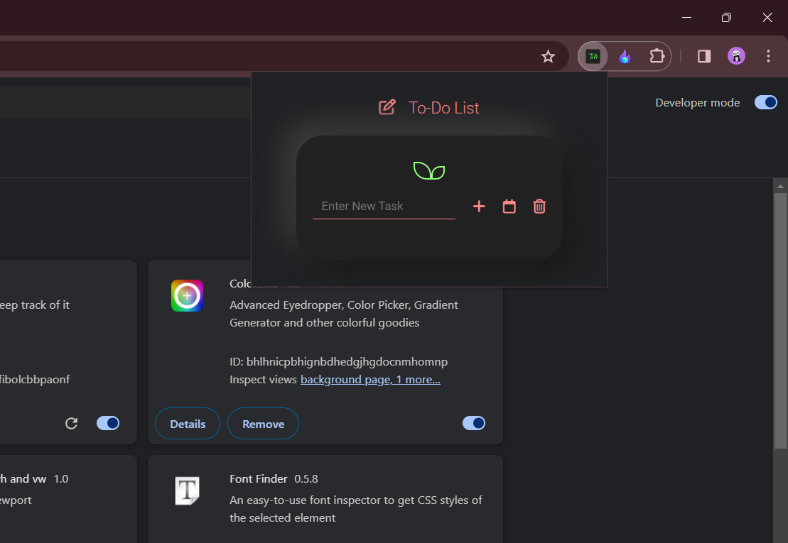
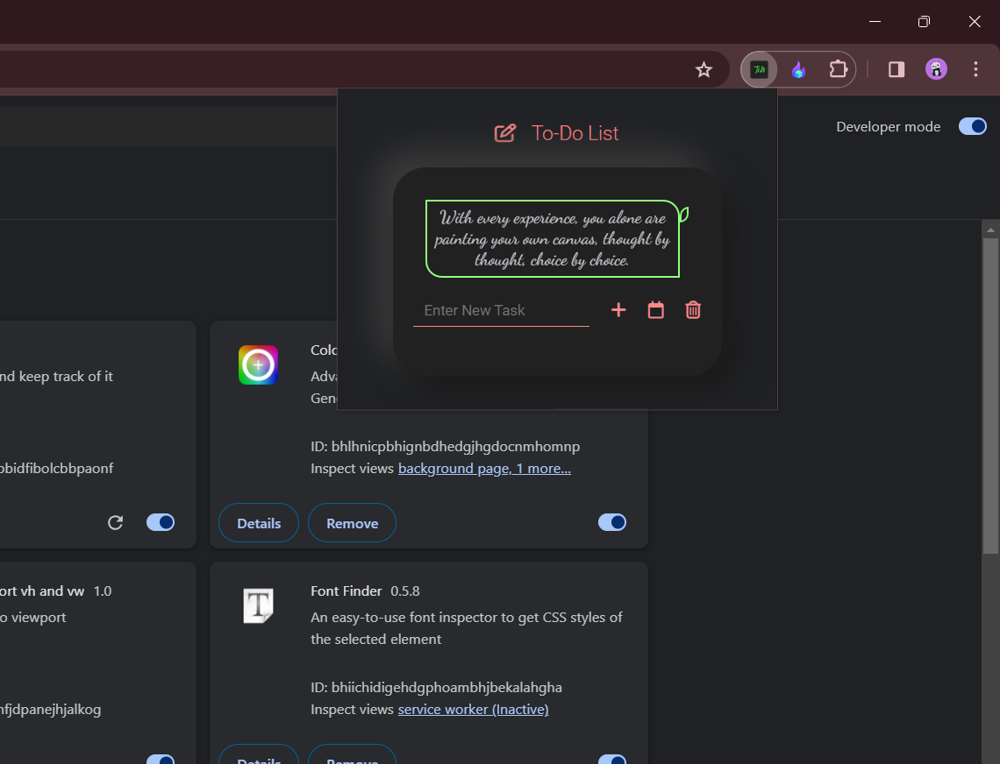
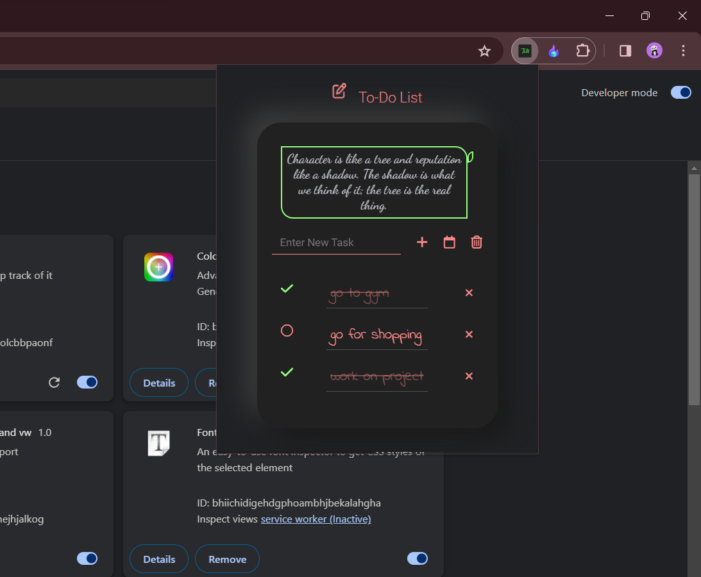
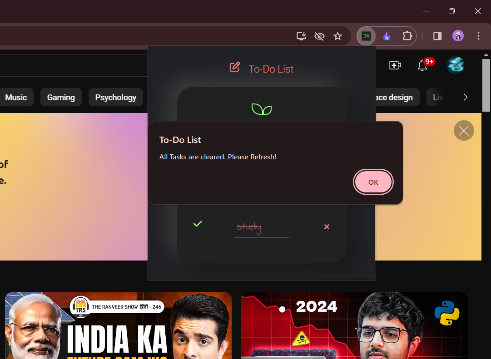

# TO-DO List Extension

Think, Write, Execute, with this TO-DO list Extension.
## Technology Used
* HTML
* CSS
* Javascript

## Objectives

### version - 1
* user can write their task✅
* Include checkbox, user can check the box once task is completed ✅
* once task is completed strike the task ✅

### version - 2 (coming soon...)
* include calender , to keep track of their daily task.
* improved technology.
* fix bugs.

## Glimpses
* At Start, this is the initial display.

* Random Quotes are generated on everytime extension open.
* If Quotes are not appeared that means **limit is reached**.
  

* Add your daily tasks and strike completed tasks.

* If you want to delete task you have to do clear all only.

## How to download on your system?

* Download the extension file (usually a ".crx" or ".zip" file).

* Open Google Chrome on your computer.

* Type chrome://extensions into the address bar and press Enter.

* Enable Developer mode by toggling the switch at the top right corner of the Extensions page.

* Locate the extension file on your computer (typically in the "Downloads" folder).

* Click and drag the extension file from its location and drop it onto the Chrome Extensions page.

* Alternatively, you can use the "Load unpacked" button on the Extensions page and navigate to the extension file.

* Chrome will prompt you to confirm the installation. Click on "Add extension" to proceed.

* Once installed, the extension should appear in your list of installed extensions on the Chrome Extensions page.

* If necessary, configure the extension by following any on-screen instructions or granting required permissions.

* Verify that the extension is working correctly by checking for its icon in the Chrome toolbar or by accessing its functionality as intended.
